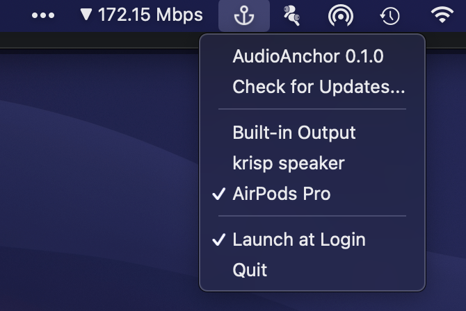

# AudioAnchor

A simple Mac app to fix sound output to a selected device.

For example, when AirPods' automatic switching is enabled, if you try to play music on your MacBook again after it has been switched from MacBook to iPhone, the music will be played from the Built-in Output.

By selecting AirPods as your audio output device, your MacBook's audio output device will always be fixed to AirPods and music will always play from AirPods as long as they are connected via Bluetooth.

## Usage

Download the latest pre-built application binary from Releases page. Note that these pre-built application binaries are not signed so you need to allow to execute it on Security & Privacy settings pane in System Preferences.